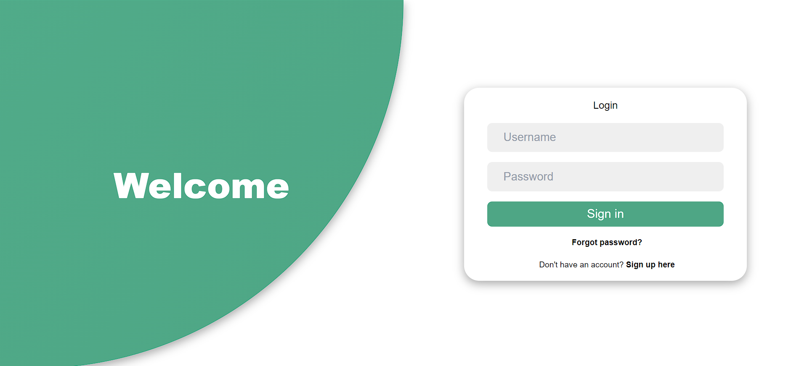

## login Page

## registration page

## user type

## Home Page

### responsive home page

## explore section

## facilator women

> ### create post section

- after creating a post pending request is generated from facilator women

- it will be approved by doctor

- respone after doctor accept the post

